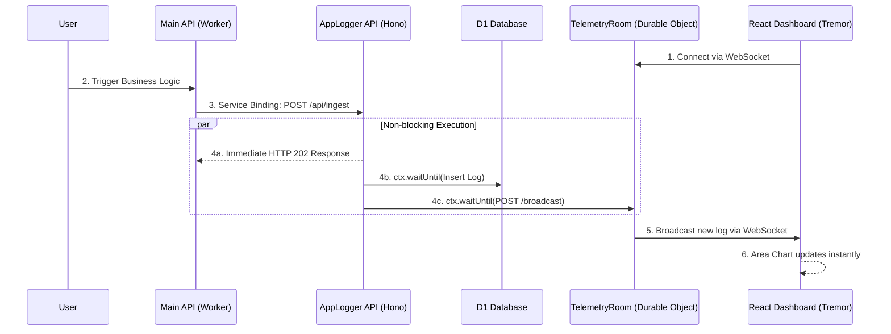

# ⚡️ Edge-Native Telemetry & Observability Hub

A full-stack, real-time observability pipeline built entirely on the Cloudflare Edge network. This project acts as an ingestion and visualization engine for distributed Cloudflare Workers, achieving zero-latency logging via Service Bindings and real-time frontend updates via Durable Objects.

## 🧠 Architectural Highlights

As a senior backend architect, I designed this system to overcome the stateless nature of edge compute while ensuring the core application's performance remains unaffected:

* **Zero-Latency Ingestion:** Main APIs send telemetry via **Cloudflare Service Bindings**, bypassing the public internet entirely.
* **Non-Blocking Persistence:** Logs are flushed to a **D1 (SQLite) Database** using `ctx.waitUntil()`, ensuring the ingestion API returns a `202 Accepted` instantly without waiting for the database I/O.
* **Stateful Real-Time Broadcasting:** Overcomes the stateless limitation of standard Workers by routing WebSocket connections to a singleton **Durable Object**, creating a persistent pub/sub room for real-time dashboard updates.
* **Monolithic Deployment, Decoupled Architecture:** A single `wrangler.jsonc` configuration deploys a compiled React SPA (Frontend Assets), a Hono.js API router, and a Durable Object cluster simultaneously.

## 🛠 Tech Stack

* **Backend:** Cloudflare Workers, Hono.js, Durable Objects, D1 (SQLite)
* **Frontend:** React 18, Vite, Tailwind CSS v3, Tremor (Data Visualization)
* **Architecture:** Monorepo (NPM Workspaces / Isolated contexts)

## 🚀 Local Development (Monorepo Workflow)

This project requires running both the edge environment and the frontend bundler simultaneously.

**1. Start the Edge Backend (Terminal 1)**
```bash
cd backend
npx wrangler d1 execute applogger-db --local --file=./schema.sql # Initialize DB
npx wrangler dev # Starts on http://localhost:8787
```
**2. Start the React Frontend (Terminal 2)**
```
cd frontend
npm run dev # Starts on http://localhost:5173
```

---

### Step 2: The VitePress Portfolio Page Update

On your main VitePress portfolio site, you should create a new section (or a dedicated page) for this project. Since VitePress supports Mermaid diagrams (which we set up in your previous portfolio configuration), we can visually prove how the `applogger` integrates with your main API.

Add this Markdown to your VitePress portfolio:

````markdown
# Project 2: Real-Time Edge Observability Pipeline

Building highly performant Edge APIs is only half the battle; observing them in real-time without introducing latency is the mark of a mature architecture. 

I engineered a custom Telemetry Dashboard (`applogger`) that runs natively on the Cloudflare Edge alongside my main application. 

::: info View the Source Code
[🔗 View the AppLogger Repository on GitHub](https://github.com/yourusername/applogger)
:::

## The System Architecture

To prevent monitoring overhead from slowing down user requests, the Main API pushes logs to the AppLogger via **Service Bindings** (V8 isolate-to-isolate communication with zero network latency). The AppLogger utilizes `ctx.waitUntil()` to non-blockingly save logs to D1, while simultaneously multicasting to a **Durable Object** that pushes updates to the React Dashboard via WebSockets.



## Modes of Operation
* **Real-time Mode**: Establishes a persistent WebSocket connection to the Durable Object. Implements Strict-Mode-safe connection handling and ring buffers to prevent memory leaks in the browser.
* **Per-Minute Polling**: A fallback REST mechanism that queries historical D1 data for low-bandwidth environments.